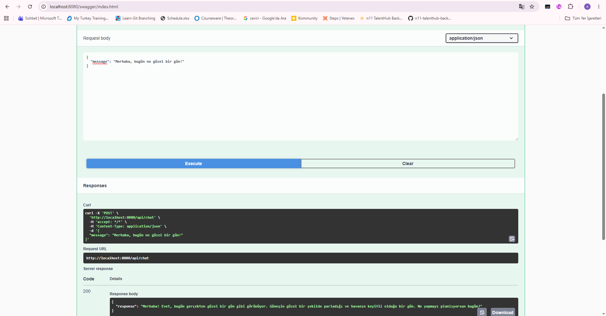
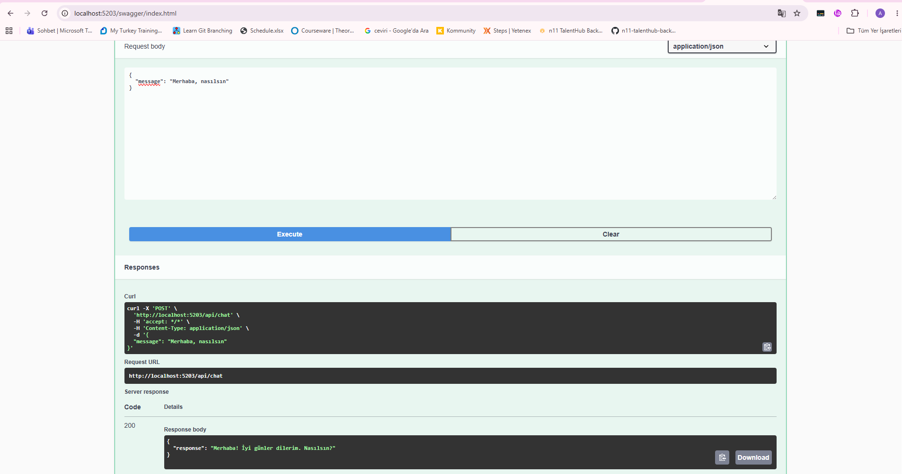
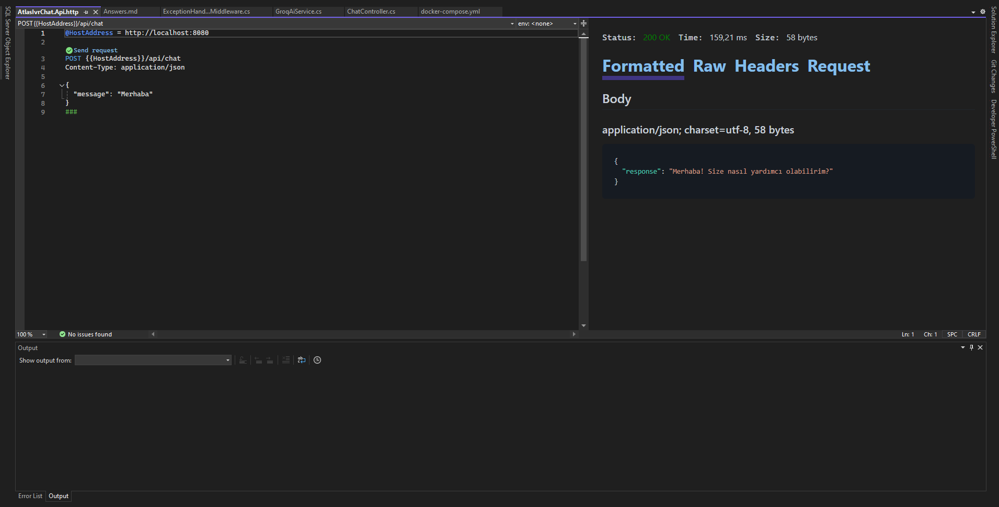
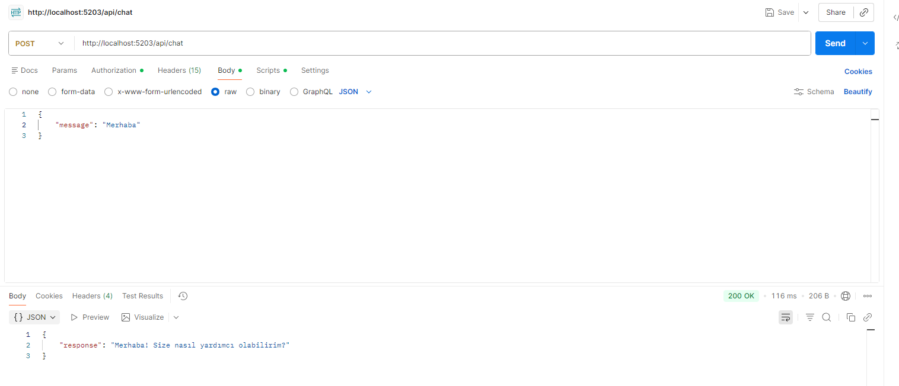
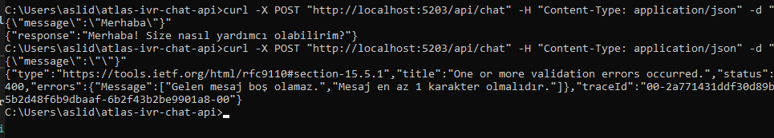

# 📞 AI-Powered IVR Chat API

Bu proje, .NET 8 mimarisi kullanılarak geliştirilmiş, yapay zeka destekli bir Sesli Yanıt (IVR) Chat API uygulamasıdır. Proje, kurumsal yazılım standartları gözetilerek **Clean Architecture** prensiplerine uygun olarak katmanlandırılmış ve tamamen **Dockerize** edilmiştir.

---

## 🏗️ Mimari Yapı ve Teknik Tercihler (Technical Decisions)

Projede iş kurallarının (business rules) ve çekirdek mantığın teknolojik bağımlılıklardan izole edilmesi amacıyla **Clean Architecture** ve **DDD (Domain-Driven Design)** yaklaşımları benimsenmiştir.

### AtlasIvrChat.Domain

Projenin kalbidir. Hiçbir dış kütüphane veya katman bağımlılığı barındırmaz.

- `IAiService` servis kontratı
- `ChatRequest`
- `ChatResponse`

modelleri bu katmanda izole edilmiştir.

### AtlasIvrChat.Infrastructure

Harici servis entegrasyonlarının çözüldüğü katmandır.

- Groq API (`llama-3.1-8b-instant`) entegrasyonu
- Yapılandırma yönetimi
- Harici servis adaptörleri

Katmanlar arası bağımlılığı azaltmak amacıyla .NET'in yerleşik `double.TryParse` ve `CultureInfo.InvariantCulture` mekanizmaları kullanılarak tip güvenli (type-safe) dönüşümler sağlanmıştır.

### AtlasIvrChat.Api

HTTP isteklerini karşılayan sunum katmanıdır.

- Attribute-based Validation
- ExceptionHandlingMiddleware
- REST API Endpoint'leri
- Swagger/OpenAPI

---

## 🤖 Neden Groq API & Llama 3.1?

IVR senaryolarında milisaniyeler seviyesindeki yanıt süreleri müşteri deneyimi açısından kritik öneme sahiptir.

Groq altyapısı;

- Çok düşük gecikme süresi (low latency)
- Yüksek çıkarım (inference) performansı
- Ücretsiz / yüksek kota
- Güçlü açık kaynak modeller

sunması nedeniyle tercih edilmiştir.

---

## 🐋 Docker ve Güvenlik Altyapısı

### Multi-Stage Build

Dockerfile içerisinde SDK ve Runtime katmanları ayrıştırılmıştır.

Avantajları:

- Daha küçük imaj boyutu
- Daha hızlı dağıtım
- Daha düşük saldırı yüzeyi
- Daha güvenli çalışma ortamı

### Platform-Agnostic Secret Injection

Canlı API anahtarları kaynak koda gömülmemiştir.

Docker konteyneri çalışırken gerekli anahtarlar host makineden ortam değişkenleri aracılığıyla alınmaktadır.

---

## 🛠️ Kurulum ve Çalıştırma Rehberi

### 1. Ön Gereksinimler

- Docker Desktop kurulu olmalıdır.
- Geçerli bir Groq API Key gereklidir.

API anahtarınızı aşağıdaki adresten ücretsiz oluşturabilirsiniz:

https://console.groq.com/

---

## 🚀 2. Projeyi Docker Üzerinde Çalıştırma

Uygulamanın platform bağımsız çalışabilmesi ve hassas bilgilerin kaynak koda sızmaması amacıyla Environment Variable yaklaşımı kullanılmıştır.

### Windows PowerShell

```powershell
# API anahtarını geçici olarak tanımlayın
$env:GROQ_API_KEY="KENDI_GROQ_API_ANAHTARINIZ"

# Docker containerlarını oluşturup çalıştırın
docker compose up -d --build
```

### Mac / Linux / Git Bash

```bash
# API anahtarını tanımlayın
export GROQ_API_KEY="KENDI_GROQ_API_ANAHTARINIZ"

# Docker containerlarını oluşturup çalıştırın
docker compose up -d --build
```

Bu işlem:

- Docker imajlarını oluşturur
- Ortam değişkenlerini konteynere aktarır
- Servisleri ayağa kaldırır
- Uygulamayı arka planda çalıştırır

Uygulama başarıyla başlatıldıktan sonra aşağıdaki adresten erişilebilir olacaktır:

```text
http://localhost:8080
```

---


## 💻 3. Projeyi Lokal Olarak Çalıştırma (IDE / CLI)

Projeyi Docker kullanmadan doğrudan geliştirme ortamınızda çalıştırmak isterseniz, .NET User Secrets altyapısı hazır olarak yapılandırılmıştır.

### Groq API Key Tanımlama

Öncelikle API anahtarınızı yerel User Secrets deposuna kaydedin:

```bash
dotnet user-secrets set "GroqSettings:ApiKey" "KENDI_GROQ_API_ANAHTARINIZ" --project src/AtlasIvrChat.Api
```

### Uygulamayı Başlatma

Ardından API projesini çalıştırın:

```bash
dotnet run --project src/AtlasIvrChat.Api
```

Uygulama varsayılan olarak aşağıdaki adreste erişilebilir olacaktır:

```text
http://localhost:5203
```

> Not: Port numarası `launchSettings.json` yapılandırmasına göre farklılık gösterebilir.

---

## 🧪 API Testi

Uygulama ayağa kalktıktan sonra Swagger UI otomatik olarak kullanılabilir olacaktır.

### Swagger UI

#### Docker Ortamı

```text
http://localhost:8080/swagger/index.html
```

#### Lokal Çalıştırma

```text
http://localhost:5203/swagger/index.html
```

Swagger UI üzerinden tüm endpoint'leri görüntüleyebilir ve doğrudan test edebilirsiniz.


## ☕ Visual Studio HTTP Client ile Test

Proje içerisinde bulunan:

```text
src/AtlasIvrChat.Api/AtlasIvrChat.Api.http
```

dosyasını açarak Visual Studio üzerinden doğrudan test gerçekleştirebilirsiniz.


```http
@HostAddress = http://localhost:8080

POST {{HostAddress}}/api/chat
Content-Type: application/json

{
  "message": "Merhaba"
}
```

---

## 📬 Postman veya cURL ile Test

### Endpoint

```http
POST http://localhost:8080/api/chat
```

### Headers

```http
Content-Type: application/json
```

### Request Body

```json
{
  "message": "Merhaba"
}
```

### cURL Örneği

```bash
curl -X POST "http://localhost:8080/api/chat" \
-H "Content-Type: application/json" \
-d '{
  "message": "Merhaba"
}'
```

### Başarılı Response (HTTP 200)

```json
{
  "response": "Merhaba! Size nasıl yardımcı olabilirim?"
}
```

### Validasyon Hatası (HTTP 400)

```json
{
  "type": "https://tools.ietf.org/html/rfc9110#section-15.5.1",
  "title": "One or more validation errors occurred.",
  "status": 400,
  "errors": {
    "Message": [
      "Gelen mesaj boş olamaz."
    ]
  }
}
```

---

## 📂 Proje Yapısı

```text
.
├── src
│   ├── AtlasIvrChat.Api
│   ├── AtlasIvrChat.Domain
│   └── AtlasIvrChat.Infrastructure
├── Dockerfile
├── docker-compose.yml
└── README.md
```

---

## 🛠️ Kullanılan Teknolojiler

- .NET 8
- ASP.NET Core Web API
- Clean Architecture
- DDD (Domain-Driven Design)
- Groq API
- Llama 3.1 8B Instant
- Docker
- Docker Compose
- Swagger / OpenAPI

---
